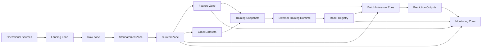

# MLOps Platform Data Architecture on Snowflake

## 1. Purpose and Scope

This document defines a target data architecture for an MLOps platform based on Snowflake. The architecture is designed to support:

- model training
- batch inference
- near-real-time scoring preparation
- feature management
- model monitoring
- retraining workflows

The first implementation scope is an MVP for one end-to-end batch ML use case. The MVP covers data ingestion, curation, feature generation, training data preparation, model training handoff, batch inference, and monitoring feedback.

## 2. Target Operating Model

### Platform principles

- Snowflake is the central data foundation for governed analytical and ML-relevant data.
- Domain teams own their data products and business semantics.
- The central platform team provides shared standards, templates, security controls, and reusable platform capabilities.
- ML artifacts must be reproducible through explicit versioning of data, features, pipelines, and models.

### Responsibility split

| Area | Primary owner | Responsibility |
| --- | --- | --- |
| Source ingestion | Data engineering | Load source data into landing and raw zones |
| Standardization and curation | Data engineering with domain owners | Harmonize schemas, quality controls, business-ready datasets |
| Feature definitions | ML engineering with domain owners | Define reusable features and serving requirements |
| Model training and registration | ML engineering | Build models, track experiments, register versions |
| Governance and security | Platform team | Access model, classification, auditing, environment isolation |
| Monitoring and retraining triggers | ML engineering with platform team | Drift, quality, and performance monitoring |

## 3. Logical Data Zones

The platform uses layered Snowflake zones with separate databases or schemas per environment.

| Zone | Purpose | Example contents |
| --- | --- | --- |
| `landing` | Initial handoff area for incoming data | staged files, ingestion manifests, connector drop-offs |
| `raw` | Immutable source-aligned persistence | source tables with minimal transformation |
| `standardized` | Conformed technical layer | normalized types, common identifiers, schema harmonization |
| `curated` | Business-ready, governed datasets | entity tables, aggregates, model input candidates |
| `feature` | Reusable feature datasets | point-in-time-safe features, feature metadata, feature snapshots |
| `training` | Training set definitions and snapshots | labels, training views, frozen training extracts |
| `inference` | Scoring inputs and outputs | batch requests, prediction results, model decision logs |
| `monitoring` | Observability and feedback signals | drift metrics, model KPIs, data quality outcomes |

### Recommended namespace pattern

For each environment:

- database per trust boundary or platform domain
- schema per zone
- object naming aligned to domain and lifecycle

Example:

- `ML_DEV.RAW_CUSTOMER`
- `ML_DEV.CURATED_SALES`
- `ML_DEV.FEATURE_CUSTOMER`
- `ML_PROD.MONITORING_MODEL`

## 4. Core Information Model

The platform should model the ML lifecycle through linked information objects.

### Core entities

| Entity | Description | Key relationships |
| --- | --- | --- |
| Source dataset | Raw technical representation of source data | feeds standardized datasets |
| Standardized dataset | Harmonized dataset with common technical rules | feeds curated datasets |
| Curated dataset | Business-consumable dataset | feeds feature calculations and training labels |
| Feature definition | Logical definition of a feature | owned by a domain or ML team |
| Feature materialization | Persisted feature values for entities and timestamps | derived from curated datasets |
| Label dataset | Supervised learning targets | joined with feature materializations |
| Training snapshot | Frozen training input for one model run | references feature version and label version |
| Model version | Registered trained model | references training snapshot and code/pipeline versions |
| Batch inference run | Execution record for a scoring run | references model version and input snapshot |
| Monitoring event | Quality or performance measurement | references model version and inference outputs |

### Reproducibility requirements

Every model version must be traceable to:

- the exact training snapshot
- the feature definition version and feature materialization timestamp
- the label dataset version
- the transformation and training pipeline version
- the hyperparameter and experiment context

Training data must be represented through frozen tables or versioned views so training can be recreated without ambiguity.

## 5. Feature Data Architecture

Features are treated as reusable data products rather than embedded one-off transformations.

### Feature architecture rules

- Separate feature definition from feature storage and feature consumption.
- Maintain point-in-time correctness for training use cases.
- Version features whenever business logic changes.
- Record feature ownership, refresh cadence, source lineage, and quality expectations.
- Reuse the same feature semantics across training and inference wherever feasible.

### Feature object categories

| Object type | Purpose |
| --- | --- |
| Feature catalog | Metadata about feature name, owner, entity, grain, refresh cadence |
| Feature definitions | Declarative or documented logic for deriving each feature |
| Feature tables | Persisted feature values by entity and event time |
| Feature snapshots | Frozen feature sets used by a given training run |
| Serving extracts | Output structures prepared for downstream scoring systems |

## 6. Pipelines and Orchestration

The architecture separates the major pipeline types while keeping lineage intact.

| Pipeline | Main outcome | Primary execution location |
| --- | --- | --- |
| Ingestion | Load source data into landing/raw | connectors or ingestion tools plus Snowflake |
| Standardization | Conform technical structure | Snowflake |
| Curation | Build business-ready datasets | Snowflake |
| Feature generation | Compute reusable features | Snowflake |
| Training set assembly | Create point-in-time-safe snapshots | Snowflake |
| Model training | Train and evaluate models | external ML runtime with Snowflake data access |
| Batch scoring | Produce predictions at scale | external ML runtime or Snowflake-adjacent execution |
| Monitoring | Compute drift and quality metrics | Snowflake plus observability integrations |

### Orchestration principles

- Use scheduled pipelines for predictable recurring workloads.
- Use event-driven triggers for source arrivals, model promotion, or retraining conditions.
- Keep orchestration metadata separate from business data, but link runs through stable run identifiers.
- Persist status and lineage for every pipeline run.

## 7. Governance, Security, and Access

### Security model

- Isolate development, test, and production environments.
- Separate experimental, governed, and sensitive workloads.
- Apply role-based access controls to schemas, tables, and views.
- Use row-level and column-level protections for restricted attributes.
- Enforce auditable access to sensitive training and inference data.

### Role model

| Role | Access pattern |
| --- | --- |
| Platform admin | Platform-wide administration and policy control |
| Data engineer | Write access in landing/raw/standardized/curated zones |
| ML engineer | Read curated data, manage feature/training/inference assets |
| Analyst | Read-only access to approved curated and monitoring outputs |
| Domain steward | Approval and governance oversight for domain datasets |
| Service role | Restricted runtime access for automated pipelines |

### Governance controls

- Data classification for public, internal, confidential, and restricted data.
- Approval process for promoting assets into curated and feature zones.
- Full lineage from source to feature to model to inference output.
- Audit trail for schema changes, access, promotions, and model usage.

## 8. Observability and Data Quality

The platform should manage technical and ML-specific observability as separate but linked concerns.

### Data quality controls

- freshness checks for inbound and curated datasets
- schema change detection
- completeness and null-threshold checks
- referential integrity on shared entity identifiers
- distribution checks for critical features and labels

### ML monitoring controls

- feature drift
- prediction drift
- model performance degradation
- data volume anomalies
- batch scoring failures and retries

### Monitoring storage

Monitoring results should be persisted in the `monitoring` zone with references to:

- dataset version
- feature version
- model version
- inference run identifier
- observation timestamp

## 9. Cost and Performance Model

### Cost principles

- separate compute workloads by ingestion, transformation, training preparation, and monitoring
- keep heavy feature computations materialized when reuse justifies the cost
- archive inactive intermediate assets based on retention policy
- distinguish development experimentation from production-grade workloads

### Performance principles

- cluster or optimize large fact-style tables around dominant entity and time access patterns
- use incremental processing for standardized, curated, and feature layers where possible
- materialize expensive joins that are reused across training and scoring
- limit broad access to raw data in production workloads

## 10. Environment and Lifecycle Model

The architecture requires strict lifecycle separation.

| Environment | Purpose |
| --- | --- |
| Dev | Fast experimentation for pipelines, features, and model development |
| Test | Controlled integration and release validation |
| Prod | Governed production workloads and monitoring |

### Promotion path

1. Define or change a dataset, feature, or pipeline in dev.
2. Validate structure, quality, and access controls in test.
3. Promote approved assets to prod.
4. Register production model versions with explicit links to approved data and feature assets.

### Required lifecycle traceability

- code version
- pipeline version
- data object version or snapshot identifier
- feature version
- model version
- deployment and scoring run identifier

## 11. Logical Architecture Diagram



## 12. Physical Inference Table Design (Snowflake)

The following design uses a concrete namespace for production inference storage.

```sql
CREATE SCHEMA IF NOT EXISTS ML_PROD.INFERENCE;

CREATE OR REPLACE TABLE ML_PROD.INFERENCE.INFERENCE_REQUEST (
    INFERENCE_REQUEST_ID STRING NOT NULL,
    REQUEST_TYPE STRING,
    REQUEST_SOURCE STRING,
    REQUESTED_BY STRING,
    REQUESTED_AT TIMESTAMP_NTZ NOT NULL,
    REQUEST_PAYLOAD VARIANT,
    CREATED_AT TIMESTAMP_NTZ NOT NULL DEFAULT CURRENT_TIMESTAMP(),
    CONSTRAINT PK_INFERENCE_REQUEST PRIMARY KEY (INFERENCE_REQUEST_ID)
);

CREATE OR REPLACE TABLE ML_PROD.INFERENCE.INFERENCE_INPUT_SNAPSHOT (
    INPUT_SNAPSHOT_ID STRING NOT NULL,
    INFERENCE_REQUEST_ID STRING NOT NULL,
    ENTITY_TYPE STRING NOT NULL,
    ENTITY_ID STRING NOT NULL,
    EVENT_TIMESTAMP TIMESTAMP_NTZ NOT NULL,
    FEATURE_SNAPSHOT_ID STRING NOT NULL,
    FEATURE_VALUES VARIANT,
    SNAPSHOT_HASH STRING,
    SNAPSHOT_CAPTURED_AT TIMESTAMP_NTZ NOT NULL,
    CREATED_AT TIMESTAMP_NTZ NOT NULL DEFAULT CURRENT_TIMESTAMP(),
    CONSTRAINT PK_INFERENCE_INPUT_SNAPSHOT PRIMARY KEY (INPUT_SNAPSHOT_ID),
    CONSTRAINT FK_INPUT_REQUEST FOREIGN KEY (INFERENCE_REQUEST_ID)
        REFERENCES ML_PROD.INFERENCE.INFERENCE_REQUEST (INFERENCE_REQUEST_ID)
)
CLUSTER BY (FEATURE_SNAPSHOT_ID, ENTITY_ID, TO_DATE(EVENT_TIMESTAMP));

CREATE OR REPLACE TABLE ML_PROD.INFERENCE.INFERENCE_RUN (
    INFERENCE_RUN_ID STRING NOT NULL,
    INFERENCE_REQUEST_ID STRING NOT NULL,
    MODEL_NAME STRING NOT NULL,
    MODEL_VERSION_ID STRING NOT NULL,
    MODEL_REGISTRY_URI STRING,
    PIPELINE_VERSION STRING,
    RUNTIME_ENGINE STRING,
    RUN_STATUS STRING NOT NULL,
    STARTED_AT TIMESTAMP_NTZ NOT NULL,
    COMPLETED_AT TIMESTAMP_NTZ,
    RUN_METADATA VARIANT,
    CREATED_AT TIMESTAMP_NTZ NOT NULL DEFAULT CURRENT_TIMESTAMP(),
    CONSTRAINT PK_INFERENCE_RUN PRIMARY KEY (INFERENCE_RUN_ID),
    CONSTRAINT FK_RUN_REQUEST FOREIGN KEY (INFERENCE_REQUEST_ID)
        REFERENCES ML_PROD.INFERENCE.INFERENCE_REQUEST (INFERENCE_REQUEST_ID)
)
CLUSTER BY (MODEL_VERSION_ID, TO_DATE(STARTED_AT));

CREATE OR REPLACE TABLE ML_PROD.INFERENCE.PREDICTION_RESULT (
    PREDICTION_RESULT_ID STRING NOT NULL,
    INFERENCE_RUN_ID STRING NOT NULL,
    INPUT_SNAPSHOT_ID STRING NOT NULL,
    MODEL_VERSION_ID STRING NOT NULL,
    FEATURE_SNAPSHOT_ID STRING NOT NULL,
    ENTITY_TYPE STRING NOT NULL,
    ENTITY_ID STRING NOT NULL,
    EVENT_TIMESTAMP TIMESTAMP_NTZ NOT NULL,
    SCORED_AT TIMESTAMP_NTZ NOT NULL,
    PREDICTED_LABEL STRING,
    PREDICTED_VALUE FLOAT,
    CONFIDENCE_SCORE FLOAT,
    PREDICTION_PAYLOAD VARIANT,
    CREATED_AT TIMESTAMP_NTZ NOT NULL DEFAULT CURRENT_TIMESTAMP(),
    CONSTRAINT PK_PREDICTION_RESULT PRIMARY KEY (PREDICTION_RESULT_ID),
    CONSTRAINT FK_PREDICTION_RUN FOREIGN KEY (INFERENCE_RUN_ID)
        REFERENCES ML_PROD.INFERENCE.INFERENCE_RUN (INFERENCE_RUN_ID),
    CONSTRAINT FK_PREDICTION_INPUT FOREIGN KEY (INPUT_SNAPSHOT_ID)
        REFERENCES ML_PROD.INFERENCE.INFERENCE_INPUT_SNAPSHOT (INPUT_SNAPSHOT_ID)
)
CLUSTER BY (MODEL_VERSION_ID, ENTITY_ID, TO_DATE(SCORED_AT));

CREATE OR REPLACE TABLE ML_PROD.INFERENCE.CLUSTERING_RESULT (
    CLUSTERING_RESULT_ID STRING NOT NULL,
    INFERENCE_RUN_ID STRING NOT NULL,
    INPUT_SNAPSHOT_ID STRING NOT NULL,
    MODEL_VERSION_ID STRING NOT NULL,
    FEATURE_SNAPSHOT_ID STRING NOT NULL,
    ENTITY_TYPE STRING NOT NULL,
    ENTITY_ID STRING NOT NULL,
    EVENT_TIMESTAMP TIMESTAMP_NTZ NOT NULL,
    SCORED_AT TIMESTAMP_NTZ NOT NULL,
    CLUSTER_ID STRING NOT NULL,
    CLUSTER_LABEL STRING,
    DISTANCE_TO_CENTROID FLOAT,
    CLUSTERING_PAYLOAD VARIANT,
    CREATED_AT TIMESTAMP_NTZ NOT NULL DEFAULT CURRENT_TIMESTAMP(),
    CONSTRAINT PK_CLUSTERING_RESULT PRIMARY KEY (CLUSTERING_RESULT_ID),
    CONSTRAINT FK_CLUSTERING_RUN FOREIGN KEY (INFERENCE_RUN_ID)
        REFERENCES ML_PROD.INFERENCE.INFERENCE_RUN (INFERENCE_RUN_ID),
    CONSTRAINT FK_CLUSTERING_INPUT FOREIGN KEY (INPUT_SNAPSHOT_ID)
        REFERENCES ML_PROD.INFERENCE.INFERENCE_INPUT_SNAPSHOT (INPUT_SNAPSHOT_ID)
)
CLUSTER BY (MODEL_VERSION_ID, CLUSTER_ID, TO_DATE(SCORED_AT));

CREATE OR REPLACE TABLE ML_PROD.INFERENCE.RANKING_RESULT (
    RANKING_RESULT_ID STRING NOT NULL,
    INFERENCE_RUN_ID STRING NOT NULL,
    INPUT_SNAPSHOT_ID STRING NOT NULL,
    MODEL_VERSION_ID STRING NOT NULL,
    FEATURE_SNAPSHOT_ID STRING NOT NULL,
    ENTITY_TYPE STRING NOT NULL,
    ENTITY_ID STRING NOT NULL,
    CANDIDATE_ITEM_ID STRING NOT NULL,
    EVENT_TIMESTAMP TIMESTAMP_NTZ NOT NULL,
    SCORED_AT TIMESTAMP_NTZ NOT NULL,
    RANK_POSITION NUMBER(10,0) NOT NULL,
    RANK_SCORE FLOAT,
    RANKING_PAYLOAD VARIANT,
    CREATED_AT TIMESTAMP_NTZ NOT NULL DEFAULT CURRENT_TIMESTAMP(),
    CONSTRAINT PK_RANKING_RESULT PRIMARY KEY (RANKING_RESULT_ID),
    CONSTRAINT FK_RANKING_RUN FOREIGN KEY (INFERENCE_RUN_ID)
        REFERENCES ML_PROD.INFERENCE.INFERENCE_RUN (INFERENCE_RUN_ID),
    CONSTRAINT FK_RANKING_INPUT FOREIGN KEY (INPUT_SNAPSHOT_ID)
        REFERENCES ML_PROD.INFERENCE.INFERENCE_INPUT_SNAPSHOT (INPUT_SNAPSHOT_ID)
)
CLUSTER BY (MODEL_VERSION_ID, ENTITY_ID, TO_DATE(SCORED_AT));

CREATE OR REPLACE TABLE ML_PROD.INFERENCE.EXPLANATION_RESULT (
    EXPLANATION_RESULT_ID STRING NOT NULL,
    INFERENCE_RUN_ID STRING NOT NULL,
    INPUT_SNAPSHOT_ID STRING NOT NULL,
    MODEL_VERSION_ID STRING NOT NULL,
    FEATURE_SNAPSHOT_ID STRING NOT NULL,
    ENTITY_TYPE STRING NOT NULL,
    ENTITY_ID STRING NOT NULL,
    EVENT_TIMESTAMP TIMESTAMP_NTZ NOT NULL,
    SCORED_AT TIMESTAMP_NTZ NOT NULL,
    TOP_REASON_CODE STRING,
    EXPLANATION_PAYLOAD VARIANT,
    CREATED_AT TIMESTAMP_NTZ NOT NULL DEFAULT CURRENT_TIMESTAMP(),
    CONSTRAINT PK_EXPLANATION_RESULT PRIMARY KEY (EXPLANATION_RESULT_ID),
    CONSTRAINT FK_EXPLANATION_RUN FOREIGN KEY (INFERENCE_RUN_ID)
        REFERENCES ML_PROD.INFERENCE.INFERENCE_RUN (INFERENCE_RUN_ID),
    CONSTRAINT FK_EXPLANATION_INPUT FOREIGN KEY (INPUT_SNAPSHOT_ID)
        REFERENCES ML_PROD.INFERENCE.INFERENCE_INPUT_SNAPSHOT (INPUT_SNAPSHOT_ID)
)
CLUSTER BY (MODEL_VERSION_ID, ENTITY_ID, TO_DATE(SCORED_AT));

CREATE OR REPLACE TABLE ML_PROD.INFERENCE.DECISION_RESULT (
    DECISION_RESULT_ID STRING NOT NULL,
    INFERENCE_RUN_ID STRING NOT NULL,
    INPUT_SNAPSHOT_ID STRING NOT NULL,
    MODEL_VERSION_ID STRING NOT NULL,
    FEATURE_SNAPSHOT_ID STRING NOT NULL,
    ENTITY_TYPE STRING NOT NULL,
    ENTITY_ID STRING NOT NULL,
    EVENT_TIMESTAMP TIMESTAMP_NTZ NOT NULL,
    DECIDED_AT TIMESTAMP_NTZ NOT NULL,
    DECISION_VALUE STRING NOT NULL,
    DECISION_SCORE FLOAT,
    DECISION_THRESHOLD FLOAT,
    DECISION_PAYLOAD VARIANT,
    CREATED_AT TIMESTAMP_NTZ NOT NULL DEFAULT CURRENT_TIMESTAMP(),
    CONSTRAINT PK_DECISION_RESULT PRIMARY KEY (DECISION_RESULT_ID),
    CONSTRAINT FK_DECISION_RUN FOREIGN KEY (INFERENCE_RUN_ID)
        REFERENCES ML_PROD.INFERENCE.INFERENCE_RUN (INFERENCE_RUN_ID),
    CONSTRAINT FK_DECISION_INPUT FOREIGN KEY (INPUT_SNAPSHOT_ID)
        REFERENCES ML_PROD.INFERENCE.INFERENCE_INPUT_SNAPSHOT (INPUT_SNAPSHOT_ID)
)
CLUSTER BY (MODEL_VERSION_ID, DECISION_VALUE, TO_DATE(DECIDED_AT));

CREATE OR REPLACE TABLE ML_PROD.INFERENCE.INFERENCE_FEEDBACK (
    INFERENCE_FEEDBACK_ID STRING NOT NULL,
    INFERENCE_RUN_ID STRING NOT NULL,
    INPUT_SNAPSHOT_ID STRING NOT NULL,
    MODEL_VERSION_ID STRING NOT NULL,
    FEATURE_SNAPSHOT_ID STRING NOT NULL,
    ENTITY_TYPE STRING NOT NULL,
    ENTITY_ID STRING NOT NULL,
    EVENT_TIMESTAMP TIMESTAMP_NTZ NOT NULL,
    FEEDBACK_TYPE STRING NOT NULL,
    ACTUAL_LABEL STRING,
    ACTUAL_VALUE FLOAT,
    FEEDBACK_PAYLOAD VARIANT,
    FEEDBACK_RECEIVED_AT TIMESTAMP_NTZ NOT NULL,
    CREATED_AT TIMESTAMP_NTZ NOT NULL DEFAULT CURRENT_TIMESTAMP(),
    CONSTRAINT PK_INFERENCE_FEEDBACK PRIMARY KEY (INFERENCE_FEEDBACK_ID),
    CONSTRAINT FK_FEEDBACK_RUN FOREIGN KEY (INFERENCE_RUN_ID)
        REFERENCES ML_PROD.INFERENCE.INFERENCE_RUN (INFERENCE_RUN_ID),
    CONSTRAINT FK_FEEDBACK_INPUT FOREIGN KEY (INPUT_SNAPSHOT_ID)
        REFERENCES ML_PROD.INFERENCE.INFERENCE_INPUT_SNAPSHOT (INPUT_SNAPSHOT_ID)
)
CLUSTER BY (MODEL_VERSION_ID, FEEDBACK_TYPE, TO_DATE(FEEDBACK_RECEIVED_AT));
```

Constraint notes:

- Primary key and foreign key constraints are included for lineage and contract clarity; in Snowflake they are typically informational and should not be relied on as enforced referential integrity.
- `VARIANT` columns keep multi-output payloads (probabilities, explanation vectors, rule traces) without losing required scalar fields for filtering and analytics.
- Cluster keys target common access paths (model version, entity, score date); retention can be managed with standard table-level retention and archival policies per environment.

### Output pattern mapping

| Output pattern | Primary table | Queryable scalar fields | Flexible payload field |
| --- | --- | --- | --- |
| Classification / regression prediction | `PREDICTION_RESULT` | `PREDICTED_LABEL`, `PREDICTED_VALUE`, `CONFIDENCE_SCORE` | `PREDICTION_PAYLOAD` |
| Probabilities / risk scores | `PREDICTION_RESULT` | `CONFIDENCE_SCORE`, `PREDICTED_VALUE` | `PREDICTION_PAYLOAD` |
| Clustering / segmentation | `CLUSTERING_RESULT` | `CLUSTER_ID`, `CLUSTER_LABEL`, `DISTANCE_TO_CENTROID` | `CLUSTERING_PAYLOAD` |
| Ranking / recommendations | `RANKING_RESULT` | `CANDIDATE_ITEM_ID`, `RANK_POSITION`, `RANK_SCORE` | `RANKING_PAYLOAD` |
| Explanation / reason codes | `EXPLANATION_RESULT` | `TOP_REASON_CODE` | `EXPLANATION_PAYLOAD` |
| Final business decisions | `DECISION_RESULT` | `DECISION_VALUE`, `DECISION_SCORE`, `DECISION_THRESHOLD` | `DECISION_PAYLOAD` |

## 13. MVP Scope

The first MVP should implement one batch-oriented ML use case with the following scope:

1. ingest one operational source into landing and raw
2. standardize and curate the source into model-ready business entities
3. define a first reusable feature set with ownership and refresh cadence
4. create versioned training snapshots with labels
5. train and register one model version outside Snowflake with lineage back to Snowflake assets
6. execute batch inference and persist predictions
7. store monitoring outputs for data freshness, feature drift, and prediction quality

## 14. Suggested Initial Deliverables

- zone and naming standard for Snowflake objects
- domain ownership matrix
- feature catalog template
- training snapshot and model lineage specification
- role and access matrix
- monitoring KPI catalog
